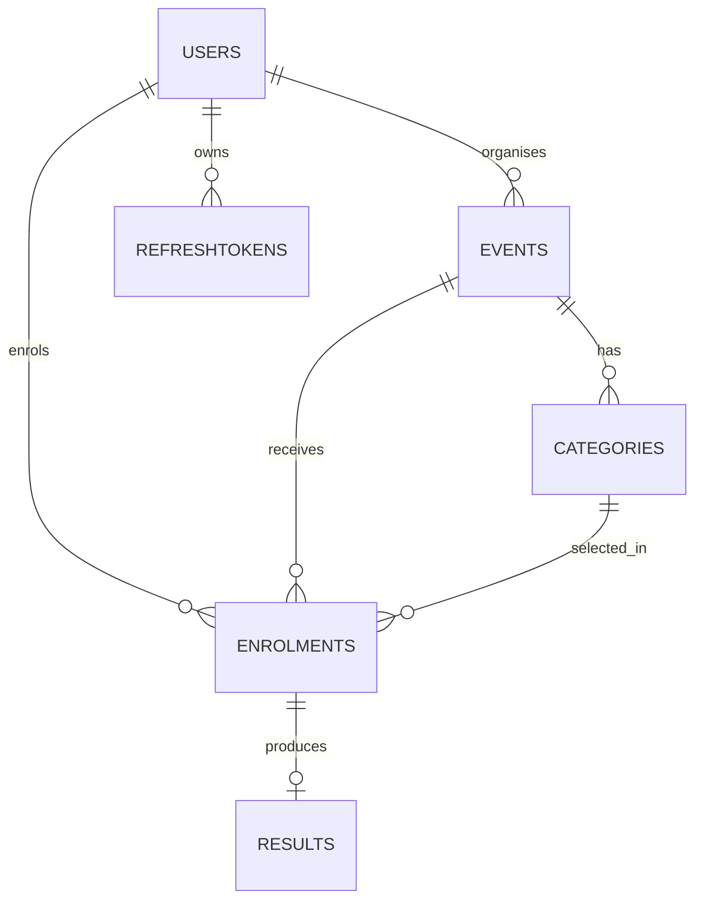

# RaceDay Part 1 — ERD

## Entities
- Users
- Events
- Categories
- Enrolments
- Results
- RefreshTokens

## Relationships
- Users (Organiser) → Events: one-to-many
- Events → Categories: one-to-many
- Users (Participant) ↔ Events: many-to-many resolved through Enrolments
- Categories → Enrolments: one-to-many
- Enrolments → Results: one-to-one
- Users → RefreshTokens: one-to-many

## Mermaid ERD

The detailed attributes and constraints are documented in the original PoE document.
